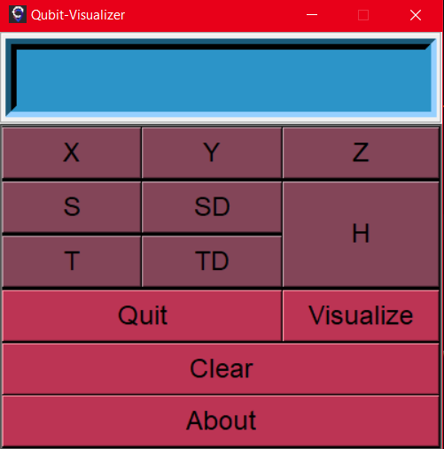
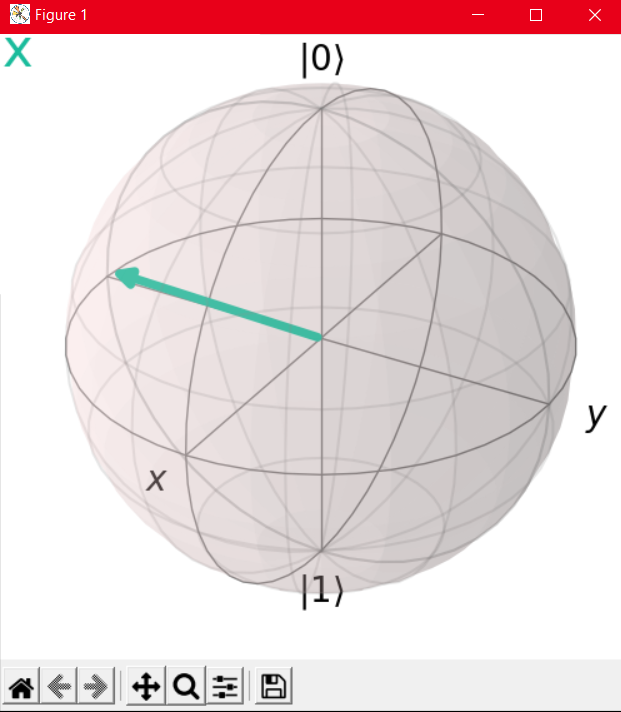

# Qubit-Visualizer

<h1 align=center>
  
By

</h1>

A very basic yet useful tool for visualizing effect of Quantum gates made using tkinter and Qiskit :)

**Screenshots**:
<h1>GUI</h1>

 

<h1>Visualization</h1>

 

